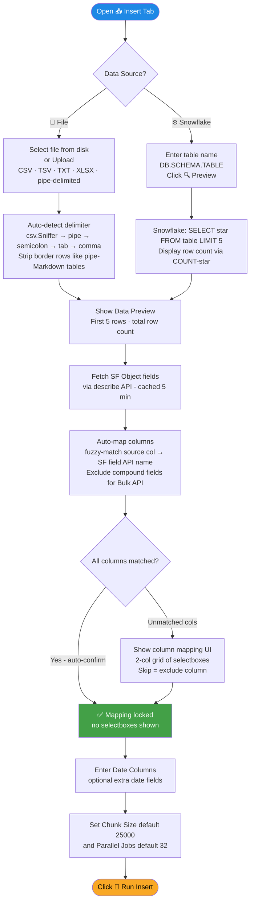
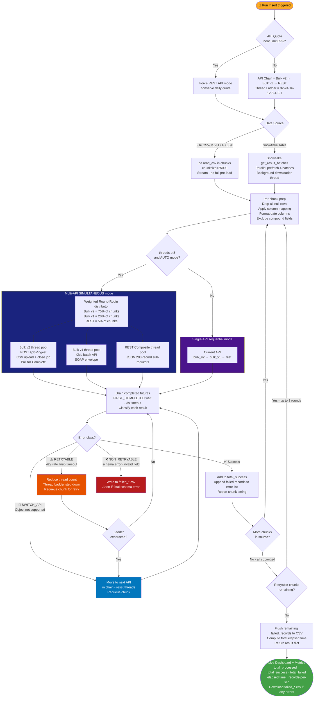
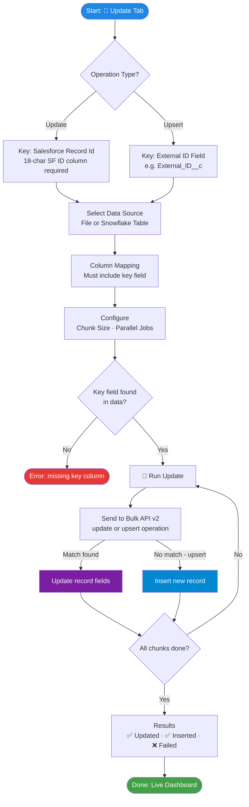
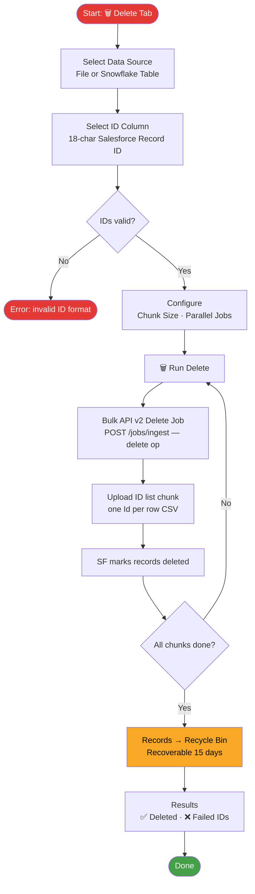
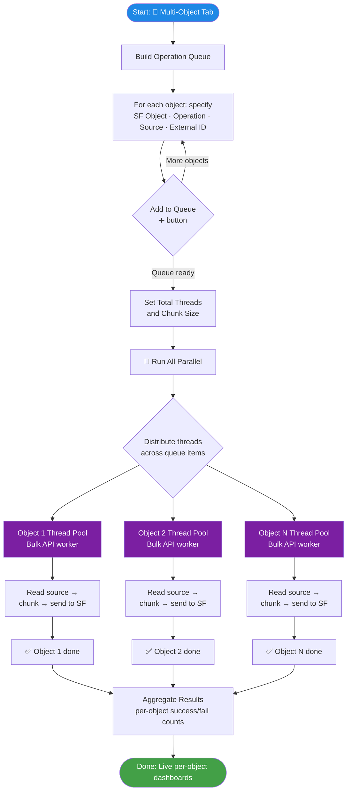
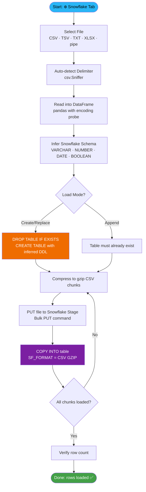
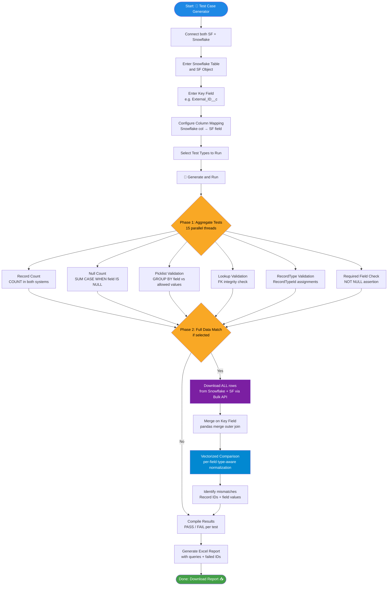
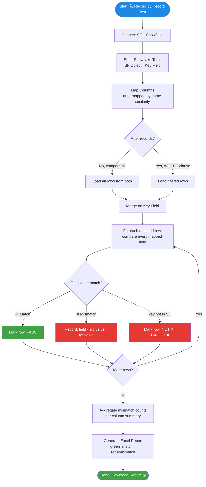
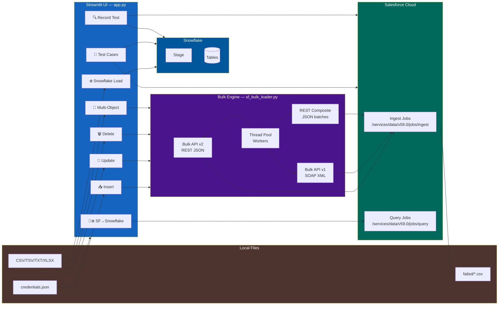
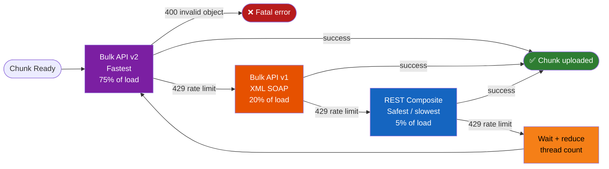

# ⚡️ SF Bulk App — Pictorial Flow Diagrams

> Mermaid flowcharts for every operation. See also: [APP_GUIDE.md](APP_GUIDE.md)

---

## 📥 Insert — Bulk Insert into Salesforce

### Step 1 — Setup (UI)



### Step 2 — Execution Engine (bulk_load_v2)



---

## 🔄 Update / Upsert — Update Existing Salesforce Records



---

## 🗑️ Delete — Bulk Delete from Salesforce



---

## 🚀 Multi-Object — Parallel Processing of Multiple Objects



---

## ❄️ Snowflake Load — File into Snowflake Table



---

## 🔄❄️ SF → Snowflake — Salesforce Extract to Snowflake ETL

```mermaid
flowchart TD
    A([Start: 🔄❄️ SF→Snowflake Tab]) --> B[Enter SOQL Query\nSELECT Id, Name ... FROM Object]
    B --> C[Set Target Table\nDB.SCHEMA.TABLE]
    C --> D{Write Mode?}
    D -->|Create/Replace| E[DROP + CREATE table]
    D -->|Append| F[Table already exists]
    E --> G[Start Bulk Query Job\nPOST /jobs/query — Bulk API v2]
    F --> G
    G --> H[Poll until Complete\nGET /jobs/query/{id}]
    H --> I{Job ready?}
    I -->|No, wait| H
    I -->|Yes| J[Stream result chunks\nGET /jobs/query/{id}/results]
    J --> K[Parse CSV chunk\npandas read_csv streaming]
    K --> L[Write chunk to Snowflake\nINSERT batch via connector]
    L --> M{More result pages?}
    M -->|Yes| J
    M -->|No| N[Save config for reuse\nsaved_sf_to_snowflake_configs.json]
    N --> O([Done: SF → Snowflake complete ✅])

    style A fill:#1e88e5,color:#fff
    style O fill:#43a047,color:#fff
    style G fill:#7b1fa2,color:#fff
    style J fill:#29b6f6,color:#000
    style L fill:#ef6c00,color:#fff
```

---

## 🧪 Test Case Generator — Automated Data Validation



---

## 🔍 Record by Record Test — Row-Level Comparison



---

## Overall System Architecture



---

## API Fallback Chain


